# eac-d — easy cd

A lightweight, opinionated continuous deployment tool for self-hosted projects.
Push your build artifacts directly onto a Proxmox LXC container — no CI/CD platform, no Kubernetes, no cloud required.

```
eacd deploy
[eacd] Files to upload: 3 / 42
[eacd] Deploying my-api → http://192.168.1.50:8765
[eacd] Installing packages: [nginx]
[eacd] rollback: backing up 3 files
[eacd] Placing /usr/local/bin/my-api
[eacd] Deployment complete
```

---

## How it works

eacd consists of two small binaries:

| Binary | Role |
|---|---|
| `eacd` | Client CLI — runs on your dev machine |
| `eacdd` | Daemon — runs on the target LXC container |

The client computes SHA-256 hashes of your build output, asks the server which files actually changed, and uploads only the delta as a compressed archive. The server extracts it, reconciles system state (packages, services, users), and runs your hooks — all streamed back to your terminal in real time.

```mermaid
sequenceDiagram
    participant D as eacd (dev machine)
    participant P as Proxmox VE
    participant S as eacdd (LXC container)

    Note over D,P: eacd init (first time only)
    D->>P: create LXC container
    P-->>D: container IP
    D->>S: install eacdd + generate token

    Note over D,S: eacd deploy
    D->>D: run local_pre hook
    D->>D: SHA-256 hash build output
    D->>S: POST /check {file hashes}
    S-->>D: list of changed files
    D->>D: pack delta → tar.gz
    D->>S: POST /deploy (manifest + archive)
    S->>S: run server_pre hook
    S->>S: reconcile inventory (packages · services · users)
    S->>S: backup existing files
    S->>S: place files
    S->>S: install / restart systemd unit
    S->>S: run server_post hook
    S-->>D: stream output (real-time) + STATUS:OK
```



---

## Features

- **Delta uploads** — only changed files are transferred
- **Proxmox-native** — optional one-command LXC provisioning with `eacd init`
- **Inventory management** — declaratively install packages, manage systemd services, and create users
- **Rollback** — automatic pre-deploy backup; restore with `eacd rollback`
- **Systemd integration** — install, enable, and restart units as part of the deploy
- **Hooks** — local pre-build, server pre-deploy, and server post-deploy scripts
- **No dependencies** — stdlib + one YAML library; no Docker, no agent framework

---

## Install

**Client (`eacd`) — Linux & macOS:**

```sh
curl -fsSL https://raw.githubusercontent.com/FratteFlorian/easycd/main/install.sh | sh
```

**Daemon (`eacdd`) — Linux/amd64 server:**

```sh
curl -fsSL https://raw.githubusercontent.com/FratteFlorian/easycd/main/install-daemon.sh | sh
```

> Both scripts download the latest release from GitHub. To pin a version: `EACD_VERSION=v0.1.0 curl ... | sh`

---

## Quick start

### Option A — Proxmox wizard (recommended)

Provision a fresh LXC container and install `eacdd` automatically:

```sh
# Build both binaries first
make build

# Run the interactive wizard
./dist/eacd init
# → "Create a new LXC container on Proxmox?" → Yes
# Wizard prompts for Proxmox credentials, container parameters,
# then creates the CT, bootstraps eacdd, and pre-fills your config.
```

The wizard:
1. Connects to your Proxmox node (credentials saved to `~/.config/eacd/proxmox.yaml`)
2. Creates an unprivileged LXC container from a template you choose
3. Installs `eacdd` via SSH, generates a random auth token, enables the systemd unit
4. Writes `server:` and `token:` into `.eacd/config.yaml` automatically

### Option B — Existing server

Install `eacdd` manually on any Linux host:

```sh
make build

# Copy the binary and service file
scp dist/eacdd root@<host>:/usr/local/bin/eacdd
scp install/eacdd.service root@<host>:/etc/systemd/system/

# Configure the daemon
ssh root@<host> "
  mkdir -p /etc/eacd /var/log/eacd /var/lib/eacd
  cat > /etc/eacd/server.yaml <<'EOF'
listen: :8765
token: $(openssl rand -hex 32)
log_dir: /var/log/eacd
EOF
  systemctl daemon-reload
  systemctl enable --now eacdd
"

# Then initialise your project locally
./dist/eacd init
# → "Create a new LXC container on Proxmox?" → No
```

---

## Project configuration

`eacd init` creates `.eacd/config.yaml` in your project root.
`.eacd/` is automatically added to `.gitignore`.

```yaml
name: my-api
server: http://192.168.1.50:8765
# token: keep-this-in-EACD_TOKEN-env-var

deploy:
  mappings:
    - src: ./dist          # relative to project root
      dest: /usr/local/bin # absolute path on the CT
      mode: "0755"
      dir_mode: "0755"
      exclude:
        - "*.log"
        - ".git/"

  # Optional: install/reload a systemd unit on every deploy
  systemd:
    unit: .eacd/my-api.service
    enable: true
    restart: true

hooks:
  local_pre:   .eacd/local-pre.sh   # runs on your machine before upload
  server_pre:  .eacd/stop.sh        # runs as root on the CT before files are placed
  server_post: .eacd/start.sh       # runs as root on the CT after files are placed
```

> **Note:** `server_pre` and `server_post` scripts execute as **root** on the CT. Write them yourself — `eacd init` creates empty stubs. A non-zero exit code in `server_pre` aborts the deployment; `server_post` failure is logged as a warning but does not fail the deploy.

**Token resolution order:** `EACD_TOKEN` env var → `token:` field in config.

Multiple `mappings` are supported — useful when you deploy a binary, a config file, and a static directory to different locations in one shot.

---

## Inventory

Create `.eacd/inventory.yaml` to declare the system state that must exist on the CT before your files land. eacd diffs the desired state against the previous deploy and only acts on changes — it installs packages that are new, removes packages that were dropped, and reconciles service states.

### Full reference

```yaml
packages:
  - nginx
  - curl

services:
  - name: nginx
    enabled: true       # enable/disable on boot
    state: started      # "started" or "stopped"

users:
  - name: appuser
    home: /home/appuser
    shell: /bin/bash
    groups:
      - www-data
```

### Example: nginx + static HTML site

This is a complete setup for deploying a static site. The project structure looks like this:

```
my-site/
├── dist/               ← built HTML/CSS/JS (deployed to /var/www/my-site)
└── .eacd/
    ├── config.yaml
    ├── inventory.yaml
    ├── my-site.conf    ← nginx vhost config (deployed to /etc/nginx/sites-enabled/)
    └── start.sh        ← reloads nginx after deploy
```

**.eacd/config.yaml**

```yaml
name: my-site
server: http://192.168.1.50:8765
# token: use EACD_TOKEN env var

deploy:
  mappings:
    - src: ./dist
      dest: /var/www/my-site
      mode: "0644"
      dir_mode: "0755"
    - src: .eacd/my-site.conf
      dest: /etc/nginx/sites-enabled/my-site
      mode: "0644"

hooks:
  server_post: .eacd/start.sh
```

**.eacd/inventory.yaml**

```yaml
packages:
  - nginx

services:
  - name: nginx
    enabled: true
    state: started
```

**.eacd/my-site.conf**

```nginx
server {
    listen 80;
    server_name _;

    root /var/www/my-site;
    index index.html index.htm;

    location / {
        try_files $uri $uri/ =404;
    }
}
```

**.eacd/start.sh**

```sh
#!/bin/sh
set -e
if [ -f /etc/nginx/sites-enabled/default ]; then
    rm /etc/nginx/sites-enabled/default
fi
nginx -t
systemctl restart nginx
```

On the first deploy eacd installs nginx, enables and starts it, places the HTML files and the vhost config, then runs `start.sh` which removes the default nginx site and restarts nginx.
Every subsequent deploy only uploads changed files and skips the package install entirely.

**Package ownership tracking** — if two projects both declare `curl`, it won't be removed when one of them drops it. Ownership state is stored at `/var/lib/eacd/.global/package-owners.json`.

Supported package managers: `apt-get`, `dnf`, `yum`, `pacman`.

---

## Rollback

Every deploy automatically snapshots the files it is about to overwrite.
To restore the previous version:

```sh
eacd rollback
[eacd] Rolling back my-api...
[eacd] rollback: restoring /usr/local/bin/my-api
[eacd] Rollback complete
```

The snapshot is stored at `/var/lib/eacd/<project>/rollback/` on the CT.
Only one snapshot (the most recent deploy) is kept per project.

---

## Commands

```
eacd init [--reinit]   Interactive wizard — creates .eacd/config.yaml
eacd deploy            Deploy to the configured server
eacd rollback          Restore the previous deployment snapshot
```

| Flag | Command | Default | Description |
|---|---|---|---|
| `--reinit` / `-r` | `init` | false | Overwrite existing config |
| `--dir <path>` | `deploy`, `rollback` | `.` | Project directory |

---

## Server daemon

`eacdd` exposes a small HTTP API on the CT:

| Endpoint | Method | Description |
|---|---|---|
| `/check` | POST | Return which files differ from the client's hashes |
| `/deploy` | POST | Receive and apply a deployment |
| `/rollback` | POST | Restore the previous snapshot |
| `/health` | GET | Liveness probe (no auth required) |

Rate limits: `/check` — 60 req/min per IP; `/deploy`, `/rollback` — 10 req/min per IP.
Deployments are serialized (one at a time).

**Server config** (`/etc/eacd/server.yaml`):

```yaml
listen: :8765
token: <32+ char random string>
log_dir: /var/log/eacd
```

Logs are written to `<log_dir>/eacdd.log` and to stdout.

> **Security notice:** eacd does not configure any firewall rules. Securing the host is entirely your responsibility. A reasonable baseline:
> - Close all ports except SSH with UFW: `ufw default deny incoming && ufw allow ssh && ufw enable`
> - Do **not** expose port 8765 publicly — keep it LAN-only or behind a VPN (see [Using eacd with a public VPS](#using-eacd-with-a-public-vps))
> - Expose your application to the internet via [Cloudflare Tunnel](https://developers.cloudflare.com/cloudflare-one/connections/connect-networks/) or a reverse proxy, not by opening ports directly

---

## Proxmox config

Proxmox credentials are stored at `~/.config/eacd/proxmox.yaml` and reused across projects:

```yaml
host: 192.168.1.10
port: 8006
node: pve
token: root@pam!mytoken=xxxxxxxx-xxxx-xxxx-xxxx-xxxxxxxxxxxx
insecure: true   # skip TLS verification for self-signed certs
```

The `PROXMOX_TOKEN` environment variable overrides the `token:` field.

Required Proxmox API token permissions: `VM.Allocate`, `VM.Config.*`, `Datastore.AllocateSpace`, `SDN.Use` (or equivalent on the target pool/node).

---

## Build

```sh
# Both binaries
make build

# Client only (runs on your machine — any OS)
make build-client

# Server binary only (Linux/amd64 — runs on the CT)
make build-server

# Run tests
make test
```

Output goes to `dist/`.

---

## State on the CT

| Path | Contents |
|---|---|
| `/etc/eacd/server.yaml` | Daemon config |
| `/var/log/eacd/eacdd.log` | Deploy logs |
| `/var/lib/eacd/<project>/rollback/` | Pre-deploy file snapshot |
| `/var/lib/eacd/<project>/inventory.json` | Last-applied inventory state |
| `/var/lib/eacd/.global/package-owners.json` | Cross-project package ownership |

---

## Using eacd with a public VPS

The Proxmox wizard is Proxmox-specific, but `eacdd` runs on any Linux host. If your target is a public VPS (DigitalOcean, Hetzner, Contabo, …), **don't expose port 8765 to the internet**. Use one of these approaches instead:

**Option 1 — SSH tunnel**

Forward port 8765 over SSH before deploying. No firewall changes needed.

```sh
# Open the tunnel in the background
ssh -L 8765:localhost:8765 root@vps.example.com -N &
TUNNEL_PID=$!

# Point your config at localhost
# server: http://localhost:8765

eacd deploy

kill $TUNNEL_PID
```

**Option 2 — VPN (Tailscale / WireGuard)**

Add both your dev machine and the VPS to the same VPN. The VPS gets a private VPN IP and eacd behaves exactly like on a LAN — no extra steps per deploy.

```sh
# Install Tailscale on the VPS
curl -fsSL https://tailscale.com/install.sh | sh
tailscale up

# Use the Tailscale IP in your config
# server: http://100.x.y.z:8765
```

---

## Philosophy

- **One CT per project.** Each deployment target is an isolated LXC container — no shared state between projects.
- **Opinionated, not extensible.** eacd does one thing: get your build output onto a container and keep it running. For anything more complex, reach for Ansible or NixOS.
- **No inbound ports.** The target only needs to be reachable from your dev machine on port 8765. Expose your application port via Cloudflare Tunnel or a reverse proxy — eacd itself does not require internet access.

---

## 🤝 Feedback & Contributing

This project is in its early stages. If you use Proxmox and hate deployment overhead as much as I do, I'd love to hear your thoughts!

What's missing for your workflow? [Open an issue](https://github.com/FratteFlorian/easycd/issues) or start a [discussion](https://github.com/FratteFlorian/easycd/discussions) — all feedback welcome.

---

## License

MIT
